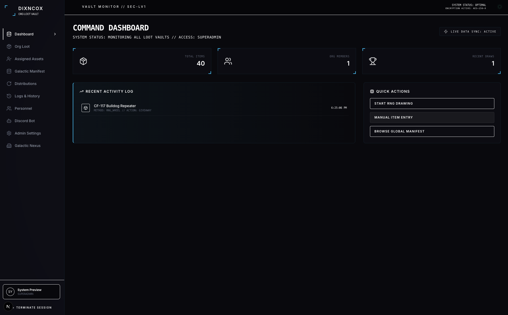
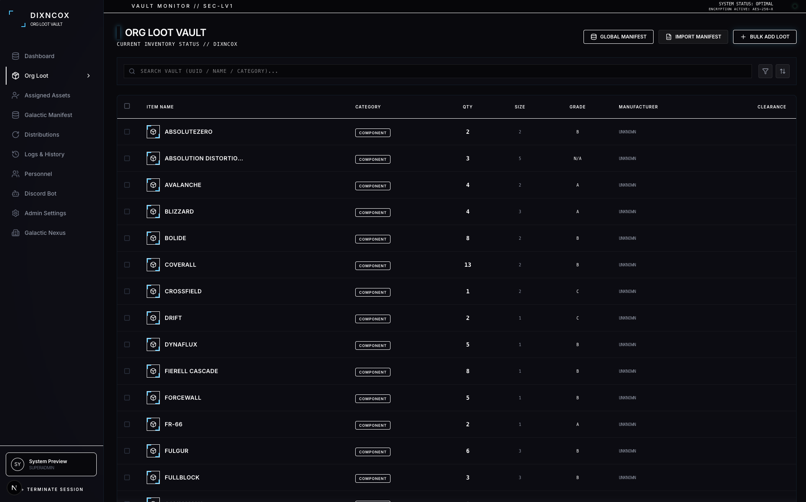
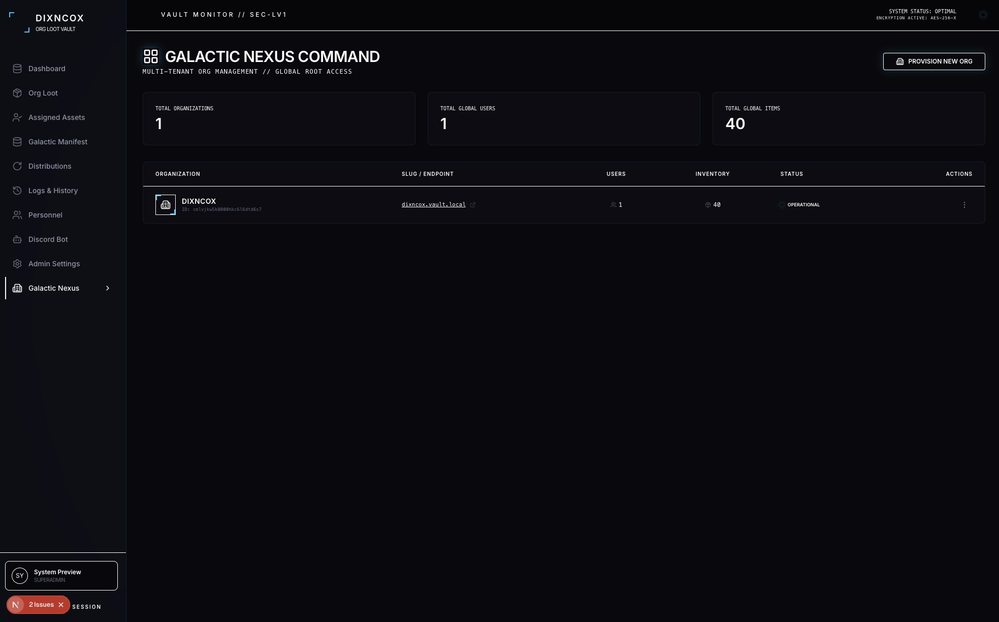
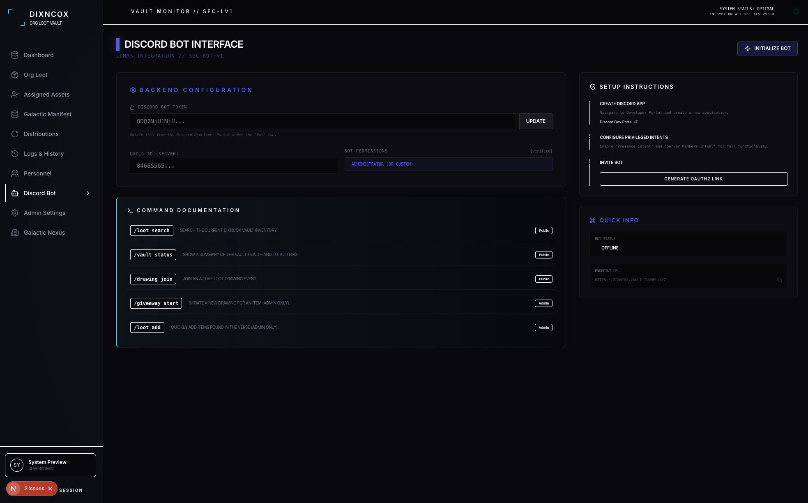

# 🚀 SC Org Loot Vault

An immersive, high-tech Star Citizen Organization Loot Vault Manager. This platform allows Orgs to track, manage, and distribute loot (Ship Components, Weapons, and Armor) with a Star Citizen-inspired HUD aesthetic. Hosted locally on Mac mini, exposed via Cloudflare Tunnels, and backed by a robust multi-tenant architecture.


---

## 🛠 Technology Stack

- **Framework:** Next.js 16 (App Router / Turbopack)
- **Language:** TypeScript
- **Styling:** Tailwind CSS 4 + `tailwindcss-animate`
- **Database:** Prisma ORM with SQLite (Local-first)
- **Authentication:** NextAuth.js v4 (Credentials & Discord OAuth)
- **API Integration:** Star Citizen Wiki API (Automatic Telemetry)
- **Real-time:** Server Actions, Revalidation, and Dynamic Polling
- **Icons:** Lucide React

---

## ✨ Core Features

### 📦 Intelligent Manifest Import
- **Dual-Method Bridge:** Import via **Google Sheets Link** (auto GID extraction) or **Local CSV Upload**.
- **Protocol Mapping:** Interactive interface to align your custom spreadsheet columns to the platform schema.
- **Smart Detection:** Automatically skips instructional noise and empty rows to find the correct header data.
- **Live Preview:** Verify parsed records before committing to the persistent organization manifest.

### 🤝 Alliance Network (Joint Ops)
- **Diplomatic Handshakes:** Send and authorize alliance requests between organizations.
- **Mutual Vault Visibility:** Allied orgs can browse each other's manifests in a secure, read-only mode.
- **Cross-Org Requests:** Request specific loot directly from an ally's inventory.
- **Joint Distributions:** Include allied personnel in your RNG drawings for combined operation events.

### 🎡 Advanced RNG Distribution
- **Dual Modes:** Toggle between **Operator Wheel** (winner gets pooled items) and **Item Roulette** (lone recipient wins one of many items).
- **Dynamic Selection:** Real-time multi-select and "Select All" tools for designating eligible operators.
- **Joint Selection:** Automatically includes allied personnel nodes when diplomatic links are active.
- **High-Tech UI:** Sliding pill-toggle interface with glowing HUD accents and hardware-entropy simulation.

### 🤖 Discord Manifest Bridge
- **Advanced Commands:** Supports both Prefix (`!vault`) and Slash (`/`) commands.
- **Account Linking:** Tie Discord IDs to Vault Operator identities via `/link-account`.
- **Remote Commands:** Access `/my-assets`, `/request-asset`, and `/vault-status` directly from your comms channel.
- **Real-time Heartbeat:** Live "OPERATIONAL" status indicator in the dashboard with pulse tracking.

### 🎨 Deep Customization & Branding
- **Dynamic Theming:** Custom control over **Primary Background**, **Accent HUD**, **Secondary Highlights**, **Success**, and **Danger** colors.
- **Identity Assets:** Upload local logo files (512x512) or link external resources.
- **Global UI Overrides:** Customize header and footer designations per organization.
- **bespoke Sidebar:** The entire navigation system reacts dynamically to your org's chosen color scheme.

### 🌌 Nexus Core (Global Admin)
- **Root Isolation:** The global admin (`ADMIN`) exists independently of specific organizations.
- **Impersonation Protocol:** Direct control over any organization node for administrative oversight.
- **Network Telemetry:** Oversee total organizations, global personnel, and network-wide asset counts.

---

## 📸 Interface Preview

> **Note:** Captured from the live SC Org Loot Vault interface.

| Command Dashboard | Vault Manifest | RNG Distribution |
| :--- | :--- | :--- |
|  |  |  |

| Alliance Network | Personnel Hub | Admin Settings |
| :--- | :--- | :--- |
|  |  |  |

---

## 🚀 Local Installation

### 1. Clone the Repository
```bash
git clone https://github.com/your-repo/sc-loot-vault.git
cd sc-loot-vault
```

### 2. Install Dependencies
```bash
npm install
```

### 3. Environment Configuration
Create a `.env` file in the root directory:
```env
DATABASE_URL="file:./dev.db"
NEXTAUTH_SECRET="your-secret-key"
NEXTAUTH_URL="https://vault.andypace.com"

# OAuth Clearances
DISCORD_CLIENT_ID="your-id"
DISCORD_CLIENT_SECRET="your-secret"
```

### 4. Initialize Database & Cache
```bash
npx prisma db push
npx ts-node scripts/seed-initial-org.ts
npx ts-node scripts/seed-sc-items.ts
```

### 5. Start Service Manager
Use the included shell script to manage PM2 processes:
```bash
chmod +x manage-vault.sh
./manage-vault.sh restart
```

---

## 🔗 Deployment & Tunneling

This platform is optimized for local hosting on a Mac mini. To expose it to your Org members:

1. **Cloudflare Tunnel:** Use `cloudflared` to route your local port `8081` to a public URL.
2. **Stealth Masking:** The application is designed to run inside an iframe via Firebase Hosting for a seamless domain experience.
3. **Route Sync:** Integrated `postMessage` listeners ensure the browser address bar stays in sync between the parent window and the local node.

---

## 📜 Technical Protocol

- **Node Version:** 20.x+
- **Database Engine:** SQLite 3
- **Styling:** Tailwind CSS 4.0
- **Data Source:** [Star Citizen Wiki API](https://api.star-citizen.wiki/)

---

Developed by **SC Loot Vault Engineering** // 2956
