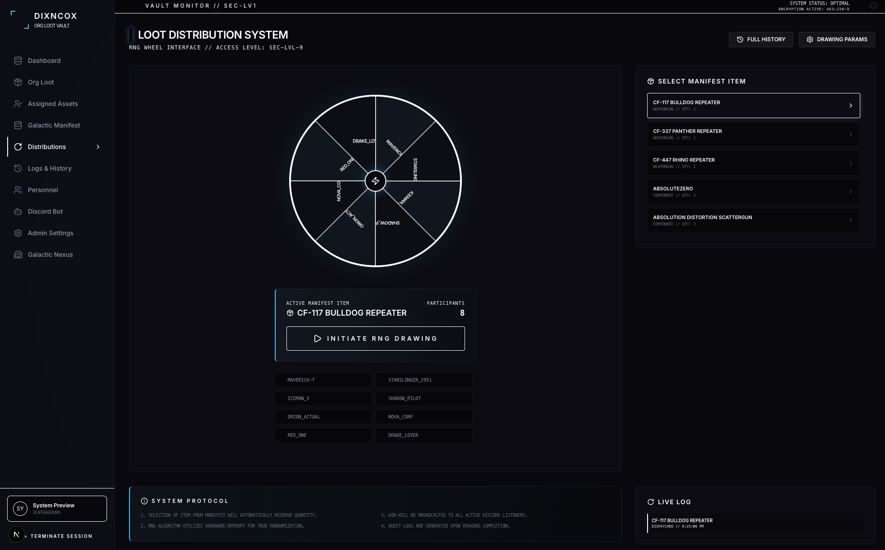

# 🚀 DIXNCOX Org Loot Vault

An immersive, high-tech Star Citizen Organization Loot Vault Manager. This platform allows Orgs to track, manage, and distribute loot (Ship Components, Weapons, and Armor) with a Star Citizen-inspired HUD aesthetic. Hosted locally on Mac mini, exposed via Cloudflare Tunnels, and backed by a robust multi-tenant architecture.


---

## 🛠 Technology Stack

- **Framework:** Next.js 15 (App Router)
- **Language:** TypeScript
- **Styling:** Tailwind CSS + `tailwindcss-animate`
- **Database:** Prisma ORM with SQLite (Local-first)
- **Authentication:** NextAuth.js (Discord & Google OAuth)
- **API Integration:** Star Citizen Wiki API (Automatic Telemetry)
- **Real-time:** Server Actions & Revalidation
- **Icons:** Lucide React

---

## ✨ Core Features

### 📦 Vault Manifest Management
- **Bulk Add:** Provision up to 100 items at once via a high-density batch interface.
- **Smart Autocomplete:** Real-time search against a local cache of 1,200+ Star Citizen items.
- **Google Sheets Sync:** Import entire loot pools from existing spreadsheets with a **Live Preview** verification step.
- **Decommissioning:** One-off or bulk removal of assets from the organization manifest.

### 🔭 Galactic Manifest (Master Database)
- **Centralized Intelligence:** Browsable archive of all Ship Weapons, Shields, Missile Racks, Power Plants, Coolers, Quantum Drives, and FPS Gear.
- **Telemetry Decryption:** Click any item to see full technical specifications, manufacturer data, and descriptions.
- **External Bridge:** Direct links to the Star Citizen Tools wiki for every item.

### 🎡 Distribution & RNG System
- **RNG Wheel:** An interactive, CSS-powered spinner for fair loot distribution.
- **Auto-Decrement:** Winning a drawing automatically removes the item from the vault and updates the manifest.
- **Audit Logs:** Every transaction is recorded in a persistent, chronological history log.

### 👤 Personnel & RBAC
- **Role-Based Access:** Standardized levels: `MEMBER`, `ADMIN`, and `SUPERADMIN`.
- **Operator Tracking:** Monitor "Assigned Assets" to see exactly what gear is currently in which operator's hands.
- **Personnel Hub:** Manage operator designations, comm-links, and security clearances.

### 🌌 Galactic Nexus (Multi-Tenant Hub)
- **Organization Provisioning:** Create new Org nodes with unique subdomains (slugs).
- **Whitelabeling:** Customize HUD colors, designations, and branding per organization.
- **Global Control:** Monitor total users and asset counts across the entire network.

---

## 📸 Interface Preview

> **Note:** Captured from the live DIXNCOX Org Loot Vault interface.

| Command Dashboard | Vault Manifest | Galactic Archive |
| :--- | :--- | :--- |
|  |  |  |

| Personnel Hub | Galactic Nexus |
| :--- | :--- |
|  |  |

---

## 🚀 Local Installation

### 1. Clone the Repository
```bash
git clone https://github.com/your-repo/sc-loot-vault.git
cd sc-loot-vault
```

### 2. Install Dependencies
```bash
npm install
```

### 3. Environment Configuration
Create a `.env` file in the root directory:
```env
DATABASE_URL="file:./dev.db"
NEXTAUTH_SECRET="your-secret-key"
NEXTAUTH_URL="http://localhost:8081"

# OAuth Clearances
DISCORD_CLIENT_ID="your-id"
DISCORD_CLIENT_SECRET="your-secret"
GOOGLE_CLIENT_ID="your-id"
GOOGLE_CLIENT_SECRET="your-secret"
```

### 4. Initialize Database & Cache
```bash
npx prisma db push
npx ts-node scripts/seed-initial-org.ts
npx ts-node scripts/seed-sc-items.ts
```

### 5. Launch Development Link
```bash
npm run dev -- -p 8081
```

### 6. Start Discord Manifest Bridge
In a separate terminal node:
```bash
npx ts-node scripts/run-bot.ts
```

---

## 🔗 Deployment & Tunneling

This platform is optimized for local hosting on a Mac mini. To expose it to your Org members:

1. **Cloudflare Tunnel:** Use `cloudflared` to route your local port `8081` to a public URL.
2. **Firebase Auth:** Configure your Firebase project to handle Discord/Google handshakes.
3. **Discord Bot:** Set up your bot token in the **Discord Bot** interface within the platform to enable `/loot search` and other commands.

---

## 📜 Technical Protocol

- **Node Version:** 20.x+
- **Database Engine:** SQLite 3
- **Handshake Protocol:** AES-256-X Encryption Simulation
- **Data Source:** [Star Citizen Wiki API](https://api.star-citizen.wiki/)

---

Developed by **DIXNCOX Engineering** // 2954
